# Mermaid Gantt Task Label Colon Compatibility

## Initial State

- Reported document: `/Users/xykong/workspace/speech-outline.md`
- Affected section: `演讲时间线与大纲版图`
- Repository commit: `c1d1f7d`
- Mermaid version: `11.12.2`
- Renderer entry point: `web-renderer/src/index.ts`

## Symptom

The Gantt diagram fails to render when a task line contains a colon in its
human-readable label in addition to the colon that separates the label from
task metadata:

```mermaid
gantt
    dateFormat X
    P1-P2: Title & 需求痛点引入 :active, 0, 90
```

The source document must remain unchanged. FluxMarkdown should render the
diagram when the intended metadata suffix is unambiguous.

## Reproduction

1. Render the Markdown source above through `window.renderMarkdown()`.
2. Observe that Mermaid rejects the task line instead of producing an SVG.
3. Capture the exact Mermaid failure from the real QuickLook extension through
   the Swift logging bridge.

## Initial Hypothesis

Mermaid's Gantt lexer treats the first ASCII colon as the task-title delimiter.
The remaining label text is then consumed as task metadata, so the second colon
produces an invalid task definition. A renderer-side compatibility pass can
escape only the non-delimiter colons on Gantt task lines, preserving the
visible label while leaving the user's document untouched.

## Acceptance Criteria

- The reported Gantt diagram renders successfully without modifying the source
  document.
- Colons inside a Gantt task label remain visible in the generated SVG.
- Standard Gantt task lines are unchanged.
- Directives, comments, and non-Gantt Mermaid diagrams are unchanged.
- Unit tests cover the reported source shape and guard against broad rewrites.

## Findings

- The installed FluxMarkdown 1.34.449 bundle is byte-for-byte identical to the
  repository's current `web-renderer/dist/index.html`.
- The real QuickLook extension logs the exact error:
  `Invalid date:“嘟嘟” PRD 自动生成器 : 90`.
- Mermaid's Gantt lexer splits a task at the first ASCII colon. For the
  reported `P3: ... : 90, 210` line, `P3` becomes the task description and
  `“嘟嘟” PRD 自动生成器 : 90` is incorrectly parsed as the start date.
- Mermaid's supported `#colon;` entity survives lexing and renders back to a
  visible colon, so it can preserve the intended label without editing the
  source document.

## Resolution

`preprocessMermaidGanttTaskColons()` now runs before Mermaid rendering. It:

1. Activates only after an exact `gantt` diagram header.
2. Skips Gantt directives, sections, comments, and accessibility metadata.
3. Recognizes the intended task-data delimiter by its spaced-colon form and a
   plausible one-to-three-field Gantt metadata suffix.
4. Replaces earlier colons in the task label with Mermaid's `#colon;` entity.

This keeps standard Gantt syntax unchanged and avoids rewriting flowcharts,
sequence diagrams, timestamps in task metadata, or user source files.

## Verification

- Targeted tests: 47 passed across `renderer.test.ts` and
  `mermaid-newline.test.ts`.
- Full renderer suite: 28 suites and 300 tests passed.
- Production Vite build completed successfully.
- Release app build, code signing, installation, QuickLook registration, and
  cache reset completed successfully.
- The installed extension bundle hash matches the newly built renderer bundle.
- Real QuickLook rendering of the unchanged `speech-outline.md` completed
  without any `JS Mermaid render error` between the renderer's `START` and
  `COMPLETE` log messages.
- Actual Mermaid 11.12.2 SVG output contains the five complete labels:
  `P1-P2: Title & 需求痛点引入`, `P3: “嘟嘟” PRD 自动生成器`,
  `P4: DONG 客户端平台与技能宝典`,
  `P5: DP-Hub 技能与一站式数据闭环`, and
  `P6: 提效成果与人机协同边界`.
